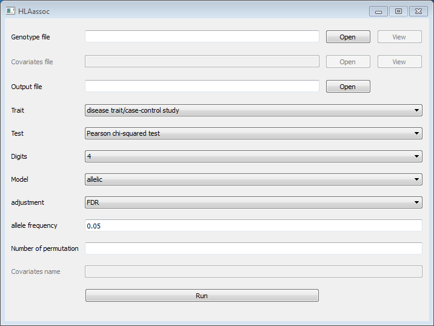
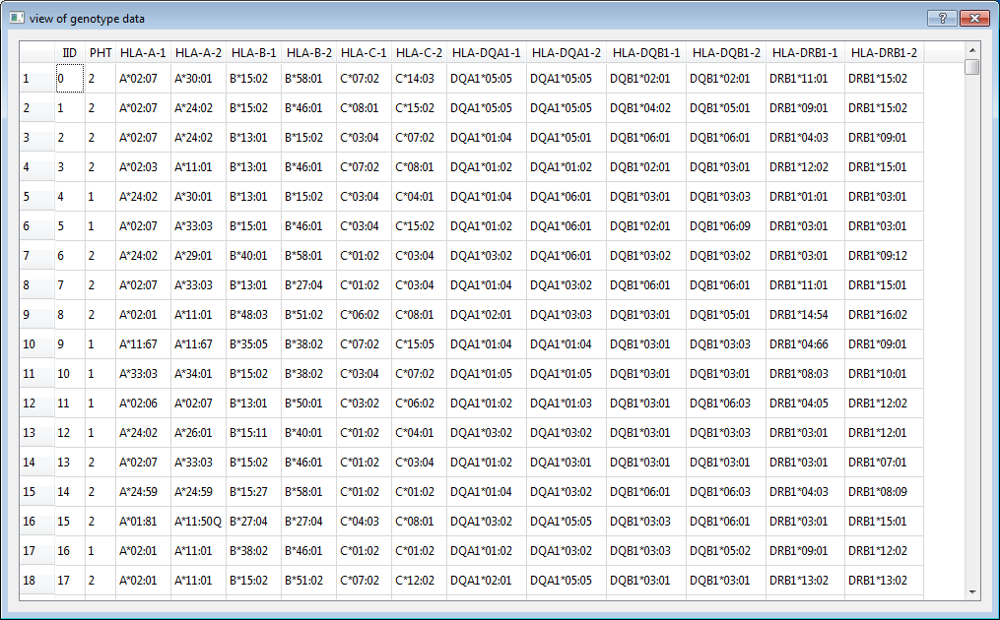
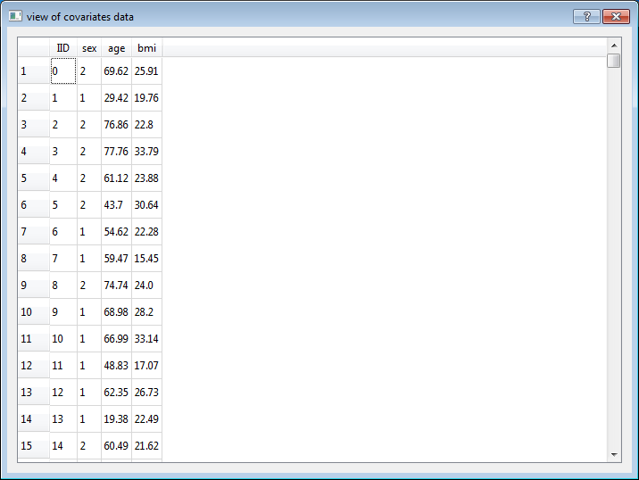
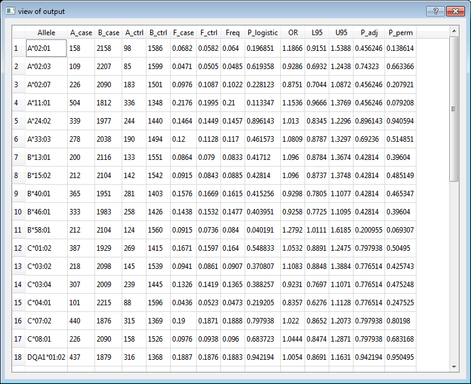

# HLAassoc: Tests for association between disease and HLA alleles.

## 0. News
* V1.6 (25 Mar 2015): add score test
* V1.5 (19 Mar 2015): add GUI
* v1.4 (12 Mar 2015): add raw test
* v1.3 (10 Mar 2015): add allele frequency to output
* v1.2 (9 Mar 2015): permutation test was added
* v1.1 (16 Feb 2015): linear and logistic regression were added
* v1.0 (23 Jan 2015): initial release.

## 1. Introduction

## 2. Requirement

* [Python 2.7](https://www.python.org/)
* [pandas](http://pandas.pydata.org/)
* [SciPy](http://www.scipy.org/)
* [StatsModels](http://statsmodels.sourceforge.net/)
* [PyQt4](https://wiki.python.org/moin/PyQt4) (If you want to use the GUI)

## 3. Installation

**Note:** There are several free scientific python distributions such as [Anaconda](http://continuum.io/downloads) and [Enthought Canopy](https://www.enthought.com/products/canopy/) which are already integrated the core scientific analytic and scientific Python packages such as `SciPy`, `pandas`, `StatsModels` and `PyQt4`. To make your life easier, I suggest you install [Anaconda](http://continuum.io/downloads) or [Enthought Canopy](https://www.enthought.com/products/canopy/)  and then you do not need to install other modules manually. If you have installed [Anaconda](http://continuum.io/downloads) or [Enthought Canopy](https://www.enthought.com/products/canopy/), please skip section `3.1` and `3.2`.

- 3.1 **Install Python 2.7**   

If you don't already have Python installed. You can follow this [guild](https://wiki.python.org/moin/BeginnersGuide/Download) to install it.

- 3.2 **Install Python modules**   

Please follow this [guild](http://pyqt.sourceforge.net/Docs/PyQt4/installation.html) to install PyQt4, if you want to use the GUI.   

```
sudo pip install pandas
sudo pip install git+http://github.com/scipy/scipy/
sudo pip install statsmodels
```

- 3.3 **Download HLAassoc**   

The latest HLAassoc is available [here](https://github.com/felixfan/HLAassoc/archive/v1.5.tar.gz).

## 4. Optionals

```
python HLAassoc.py -h
usage: HLAassoc.py [-h] [-v] -i FILE [-d {2,4,6}] [-m {allelic,dom,rec}]
                   [-t {chisq,fisher,logistic,linear,raw,score}] [-c COVAR]
                   [-n COVARNAME] [-f FREQ] [-a {FDR,Bonferroni,Holm}]
                   [-o OUT] [-V {False,True}] [-p PERM] [-s SEED]

HLA Association Analysis

optional arguments:
  -h, --help            show this help message and exit
  -v, --version         show program's version number and exit
  -i FILE, --file FILE  input file
  -d {2,4,6}, --digits {2,4,6}
                        digits to test, default 4
  -m {allelic,dom,rec}, --model {allelic,dom,rec}
                        genetic model, default allelic
  -t {chisq,fisher,logistic,linear,raw,score}, --test {chisq,fisher,logistic,linear,raw,score}
                        statistical test method, default chisq
  -c COVAR, --covar COVAR
                        covariants file
  -n COVARNAME, --covarname COVARNAME
                        select a particular subset of covariates
  -f FREQ, --freq FREQ  minimal frequency, default 0.05
  -a {FDR,Bonferroni,Holm}, --adjust {FDR,Bonferroni,Holm}
                        p value correction, default FDR
  -o OUT, --out OUT     output file
  -V {False,True}, --print {False,True}
                        print output to screen
  -p PERM, --perm PERM  number of permutation
  -s SEED, --seed SEED  random seed
```

### 4.1) HLA types file (-i or --file)  

The input file is a white-space (space or tab) delimited file. The first two columns are mandatory: Individual ID and Phenotype. The Individual IDs are alphanumeric and should uniquely identify a person. The second column is phenotype which can be either a quantitative trait or an affection status. Affection status should be coded as 1 and 2 for unaffected and affected, respectively.

HLA types (column 3 onwards) should also be white-space delimited. Every gene must have two alleles specified. All alleles (see [Nomenclature of HLA Alleles](http://hla.alleles.org/nomenclature/naming.html)) do not need to have the same digits. However, if you want to test association at 4 digits, all alleles should have at least 4 digits resolution. Missing genotype is denoted as `NA`.

No header row should be given. For example, here are two individuals typed for 6 genes (one row = one person):  

```
0001 2 A*02:07:01 A*11:01:01 B*51:01:01 B*51:01:01 C*14:02:01 C*14:02:01 DQA1*01:04:01 DQA1*01:04:01 DQB1*03:03:02 DQB1*05:02:01 DRB1*07:01:01 DRB1*14:54:01
0002 1 A*24:02:01 A*33:03:01 B*15:25:01 B*58:01:01 C*03:02:02 C*04:03 NA NA DQB1*03:01:01 DQB1*03:01:01 DRB1*03:01:01 DRB1*12:02:01
```

**Note:** There are one case and one control. The six genes are: HLA-A, HLA-B, HLA-C, HLA-DQA1, HLA-DQB1 and HLA-DRB1. Each gene has two columns.

**Note:** Individual `0002` does not have genotype for HLA-DQA1 (two `NA`). All alleles have six digits resolution except that one allele of HLA-C of individual `0002` only has four digits resolution. It is fine if we only want to test association at two or four digits resolution.  

**Note:** The allele name contains the HLA prefix, but the allele names in the above example do not have the HLA prefix. Allele names have the HLA prefix can also be used as input. e.g. `A*02:07:01 A*11:01:01` is the same as `HLA-A*02:07:01 HLA-A*11:01:01`.

### 4.2) Digits resolution (-d or --digits)   

Test of association using two digits, four digits or six digits. When two was used, alleles such as `A*02:01` and `A*02:06` will be combined as `A*02`. Default value is 4.

### 4.3) Genetic model to test (-m or --model)   

When Pearson chi-squared test or Fisher's exact test was used, three genetic models can be specified.   

```
allelic    compares one allele against the others group together
dom        compares individuals carry one allele against individuals do not carry it
rec        compares individuals carry homozygous of one allele against other individuals
```

Default value is *allelic*.

**Note:** `--model` only effect when `--test chisq` or `--test fisher` is specified.

### 4.4) Methods for association test (-t or --test)

```
chisq       Pearson chi-squared test (For disease traits, 2 x 2 coningency table)
fisher      Fisher's exact test (For disease traits, 2 x 2 coningency table)
logistic    logistic regression (For disease traits)
linear      linear regression (For quantitative traits)
raw         Pearson chi-squared test (For disease traits, 2 x m coningency table) 
```
When linear or logistic regression was used, assume `A*01:01` is the test allele, then `A*01:01 A*01:01` is code as 2, `A*01:01 A*01:02` is code as 1, and `A*01:02 A*01:03` is code as 0.

Default value is *chisq*.

### 4.5) Covariates file (-c or --covar)

One or more covariates can be included in linear and logistic regression.

The covariates file is a white-space (space or tab) delimited file. The first row is header. Row 2 onwards contain the individual ID (IID) and measures of several traits. Each row for one individual. The first column is IID and column 2 onwards contain measures of several traits. Each column for one trait.

For example, here are two individuals with three traits:

```
IID  age sex bmi
0001 28  1   20.70
0002 23  0   16.29
```

**Note:** Name of trait should not include any white-space.

**Note:** `--covar` only effect when `--test linear` or `--test logistic` is specified.

**Note:** The order of individuals in covariates file does not have to be the same as the genotype input file. The number of individuals in covariates file also does not have to be the same as the genotype input file. Only the common individuals of both files were included in the analysis.

### 4.6) Covariates name (-n or --covarname)

To select a particular subset of covariates, use `--covarname covarnames` command.

*covarnames* is a string of trait names (in the header row of covariates file) concatenate with comma(,).

For example,

```
--covar cov.txt                                    # use all covariates in cov.txt
--covar cov.txt --covarname bmi                    # only use `bmi`
--covar cov.txt --covarname age,bmi                # use both `age` and `bmi`
--covar cov.txt --covarname age,sex,bmi            # use all three covariates
```

**Note:** if `--covarname covarnames` command is not specified, all covariates in cov.txt will be used.

### 4.7) Minimal allele/allele group frequency (-f or --freq)

A value between 0 and 1. Only alleles/allele groups have frequency higher than this threshold will be included in association analysis. Default value is 0.05. For quantitative traits, allele frequency in the whole dataset is used to compare with the threshold. For disease traits, one allele will be included if its frequency in case or control is higher than the threshold.

### 4.8) Adjustment for multiple testing (-a or --adjust)

```
Bonferroni         Bonferroni single-step adjusted p-values
Holm               Holm (1979) step-down adjusted p-values
FDR                Benjamini & Hochberg (1995) step-up FDR control
```

### 4.9) Permutation (-p or --perm)

Number of permutation will be performed.   

For each permutation run, a simulated dataset is constructed from the original dataset by randomizing the assignment of phenotype status among individuals. The same individuals are used, maintaining the same LD structure and the original case/control ratio. 

### 4.10) Output file name (-o or --out)

Default value is `hlaassoc.txt`.

### 4.11) Print output to screen (-V or --print)

Default value is `False`.

### 4.12) Random seed (-s or --seed)

A number used to initialize the basic random number generator. By default, the current system time is used. 

## 5. Output

Output contains several fields depend on which commands were used.  

```
Allele        Allele name
Gene          Gene name
A_case        Count of this allele in cases
B_case        Count of other alleles in cases
A_ctrl        Count of this allele in controls
B_ctrl        Count of other allele in controls
F_case        Frequency of this allele in cases
F_ctrl        Frequency of this allele in controls
Freq          Frequency of this allele in cases and controls
Chisq         Chi-square
DF            Degree of freedom
P_chisq       P-value for Pearson's chi-squared test
P_Fisher      P-value for Fisher's exact test
P_logistic    P-value for logistic regression
P_linear      P-value for linear regression
OR            Odds ratio
beta          Regression coefficient
L95           Lower bound of 95% confidence interval for odds ratio or regression coefficient
U95           Upper bound of 95% confidence interval for odds ratio or regression coefficient
P_adj         Multiple testing adjusted p value 
P_perm        P-value for permutation test
```

### 5.1 `--test chisq` or `--test fisher`

For each allele, a 2 X 2 coningency table contains the count of this allele and the count of the other alleles in the same gene in cases and controls was created. The total number of test is the number of alleles have frequency in cases or controls higher the the threshold specified by option `--freq` or `-f`.

The output includes: `Allele`, `A_case`, `B_case`, `A_ctrl`, `B_ctrl`, `F_case`, `F_ctrl`, `Freq`, `OR`, `L95`, `U95`, `P_adj`. The output of Pearson's chi-squared test also includes: `Chisq`, `DF`, `P_chisq`. The output of Fisher's exact test also includes: `P_Fisher`. When `--perm` is used, another column `P_perm` is added to the output.  

### 5.2 --test logistic or --test linear

For each allele, one individual will be coded as 2, 1, 0, if the individual has two copies, one copy, and zero copy of this allele, respectively. The total number of test is the number of alleles have frequency in cases or controls higher the the threshold specified by option `--freq` or `-f`.

The output includes: `Allele`, `A_case`, `B_case`, `A_ctrl`, `B_ctrl`, `F_case`, `F_ctrl`, `Freq`, `L95`, `U95`, `P_adj`. The output of logistic regression also includes: `OR`, and `P_logistic`. The output of linear regression also includes: `beta` and `P_linear`. When `--perm` is used, another column `P_perm` is added to the output. 

### 5.3 --test raw

Raw test performs a Pearson's chi-squared test on the 2 x m contingency tables for each gene. `m` is the number of alleles have frequency in cases or controls higher the the threshold specified by option `--freq` or `-f`.    

The output includes: `Gene`, `Chisq`, `DF`, `P_chisq`. When `--perm` is used, another column `P_perm` is added to the output.   

## 6. Usage

```
python HLAassoc.py -h
python HLAassoc.py --help
python HLAassocGUI.py       (start the GUI)
```

### 6.1) Disease trait (Case/Control Study)

* Pearson's chi-squared test   

The following three commands are equivalent. They perform the Pearson's chi-squared test for each allele that has frequency higher than 0.05 in cases or controls at 4 digits resolution. FDR was used to adjust the p value for multiple testing. Do not write the output to the screen. Save the output to `hlaassoc.txt`.   

```
python HLAassoc.py --file input0.txt
python HLAassoc.py -i input0.txt
python HLAassoc.py --file input0.txt --digits 4 --test chisq --model allelic --freq 0.05 --adjust FDR --print False --out hlaassoc.txt
```

1000 permutation test:   

```
python HLAassoc.py --file input0.txt --perm 1000
```

Test all alleles and perform 10000 permutation test (it takes about 7 minutes):   

```
python HLAassoc.py --file input0.txt --perm 10000 --freq 0
```

**Note:** Order of options do **NOT** matter.    

* Fisher's exact test     

Fisher's exact test shares the same parameters with Pearson's chi-squared test. The following three commands are equivalent.   

```
python HLAassoc.py --file input0.txt --test fisher
python HLAassoc.py -i input0.txt -t fisher
python HLAassoc.py --file input0.txt --digits 4 --test fisher --model allelic --freq 0.05 --adjust FDR --print False --out hlaassoc.txt
```

* Logistic regression   

```
python HLAassoc.py -i input0.txt -t logistic
python HLAassoc.py --file input0.txt --test logistic
python HLAassoc.py --file input0.txt --digits 4 --test logistic --freq 0.05 --adjust FDR --print False --out hlaassoc.txt
```

Logistic regression with covariants: the first command uses all variants in `covar.txt` as covariants, the second command uses `age` and `bmi` as covariants.

```
python HLAassoc.py --file input0.txt --digits 4 --test logistic --freq 0.05 --adjust FDR --print False --out hlaassoc.txt --covar covar.txt
python HLAassoc.py --file input0.txt --digits 4 --test logistic --freq 0.05 --adjust FDR --print False --out hlaassoc.txt --covar covar.txt --covarname age,bmi
```

* Raw test   

```
python HLAassoc.py -i input0.txt -t raw
python HLAassoc.py --file input0.txt --test raw
python HLAassoc.py --file input0.txt --digits 4 --test raw --freq 0.05 --adjust FDR --print False --out hlaassoc.txt
```

### 6.2) Quantitative trait

* Linear regression   

```
python HLAassoc.py -i input1.txt -t linear
python HLAassoc.py --file input1.txt --test linear
python HLAassoc.py --file input1.txt --digits 4 --test linear --freq 0.05 --adjust FDR --print False --out hlaassoc.txt
```

Linear regression with covariants: the first command uses all variants in `covar.txt` as covariants, the second command uses `age` and `bmi` as covariants.
```
python HLAassoc.py --file input1.txt --digits 4 --test linear --freq 0.05 --adjust FDR --print False --out hlaassoc.txt --covar covar.txt
python HLAassoc.py --file input1.txt --digits 4 --test linear --freq 0.05 --adjust FDR --print False --out hlaassoc.txt --covar covar.txt --covarname age,bmi
```

### 7. Gallery






